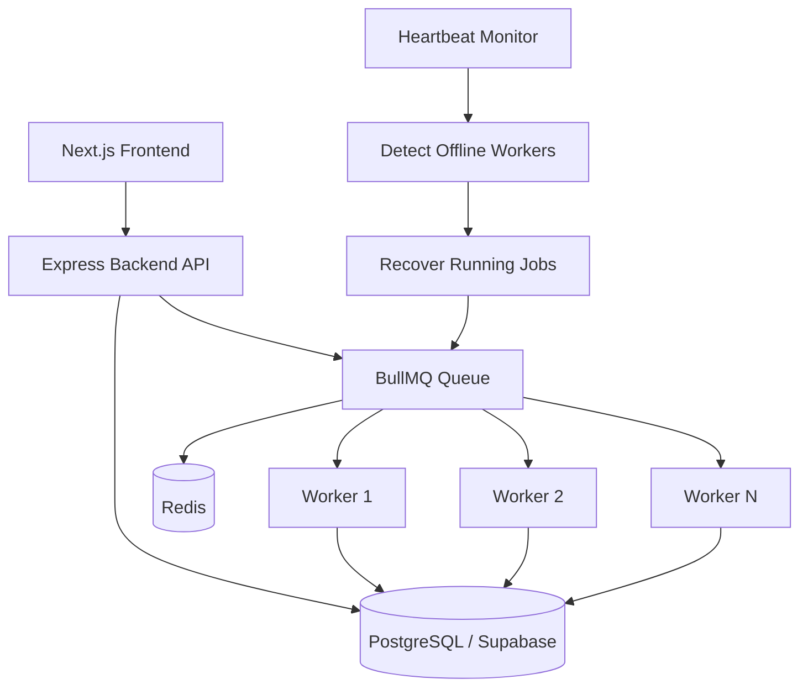
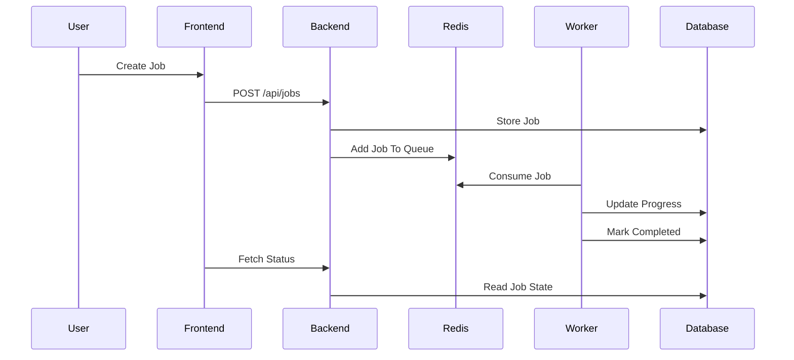

# Distributed Job Execution System - Architecture

## Overview

This project implements a distributed job execution platform that allows jobs to be submitted, queued, processed by workers, monitored in real time, and recovered automatically in case of worker failures.

The system is designed around a producer-consumer architecture using BullMQ and Redis.

---

## High-Level Architecture

### Processing Flow

---

## Components

### Frontend

Technologies:

* Next.js
* React
* Tailwind CSS

Responsibilities:

* Dashboard visualization
* Job creation
* Job monitoring
* Worker monitoring
* Execution history viewing

---

### Backend API

Technologies:

* Node.js
* Express.js

Responsibilities:

* Job creation
* Worker registration
* Heartbeat management
* Job retrieval
* Worker retrieval
* Recovery orchestration

---

### PostgreSQL Database

Hosted on Supabase.

Stores:

* Jobs
* Workers
* Execution History

Purpose:

* Persistent state management
* Progress tracking
* Audit trail

---

### Redis

Used as BullMQ's backing store.

Responsibilities:

* Queue management
* Job scheduling
* Retry handling
* Delayed processing

---

### BullMQ

Responsibilities:

* Job queueing
* Priority scheduling
* Retry handling
* Worker coordination

Configuration:

* Priority based execution
* Exponential backoff retries
* Configurable attempt count

---

### Workers

Responsibilities:

* Execute queued jobs
* Report progress
* Update checkpoints
* Send heartbeats

Each worker:

* Registers itself
* Sends periodic heartbeats
* Updates execution status
* Can recover interrupted jobs

---

## Job Lifecycle

1. User creates a job.
2. Backend stores job in PostgreSQL.
3. Job is pushed into BullMQ.
4. Available worker receives job.
5. Worker marks job RUNNING.
6. Progress checkpoints are stored.
7. Job completes successfully.
8. Execution history is recorded.

---

## Failure Handling Strategy

### Worker Crash Recovery

Workers send heartbeats every few seconds.

If a worker stops sending heartbeats:

1. Heartbeat monitor detects stale worker.
2. Worker marked OFFLINE.
3. Running jobs assigned to that worker are recovered.
4. Jobs are re-queued.
5. Another worker can continue execution.

---

### Checkpoint Recovery

Jobs periodically store:

* progress
* last_checkpoint

If a worker crashes:

1. Last checkpoint is preserved.
2. Recovered job is re-queued.
3. New worker resumes from saved checkpoint.

This prevents restarting the entire job.

---

### Retry Strategy

BullMQ provides:

* Configurable retry count
* Exponential backoff

Transient failures such as:

* Network issues
* Database timeouts

can be automatically retried.

---

## Scalability Considerations

The architecture supports horizontal scaling.

Multiple worker instances can be started:

Worker 1
Worker 2
Worker 3
Worker N

BullMQ distributes jobs automatically.

Benefits:

* Increased throughput
* Better fault tolerance
* Improved resource utilization

---

## Design Decisions

### BullMQ + Redis

Chosen because:

* Reliable queue management
* Built-in retries
* Priority support
* Production-ready ecosystem

### PostgreSQL

Chosen because:

* Strong consistency
* Relational data model
* Reliable transaction support

### Heartbeat Monitoring

Chosen because:

* Detects worker failures quickly
* Enables automatic recovery
* Improves system reliability

### Checkpoint-Based Execution

Chosen because:

* Reduces wasted work
* Allows recovery from interruptions
* Demonstrates fault-tolerant design
